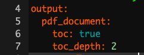

```{r options, include=FALSE}
htmltools::tagList(rmarkdown::html_dependency_font_awesome())
```


# Introduction

Since one of my goals is to teach this course next year, in my free time I will
be writing up some materials that would serve as a guide. 
It is by no means necessary to ready any of the things on here to succeed in the 
course, however I hope tips and readings I post here could help speed up your 
work and provide additional understanding of the material, beyond what you learn
in the classroom right now.

## Resources:

In case you have never worked with R up until this point, below is a guide to 
setting everything up. If you are ready, just use the navbar on the left to 
skip this and go to the first chapter - Visualizations. I would advise that you
at least take a look at the packages I am using for this.

## Downloading R and Rstudio.

1. Go to the UofT CRAN [website](http://cran.utstat.utoronto.ca/) and download
and install R for your Operating System.

2. Go to the Rstudio [website](https://www.rstudio.com/products/rstudio/download/#download) and
download and install it.

## Downloading important packages

Open Rstudio, and navigate to the console. Then run the following commands to get
the packages I highly recommend you get:

install.packages(c('gridExtra','summarytools','tidyverse','plotly'))

You might need to replace the quotation marks if you copypaste this.

This will install all the packages we should need for the class and beyond.
Whenever you want to add a package you can either call the command:

install.packages(\<quoted package name\>)

or navigate to the Files and plots pane in Rstudio, click on packages, then 
install, and type in the name.

**Note that you only need to do this once, and the packages will remain for any R script you are writing.**

## Learning

There is a number of resources available for you to learn and master the 
tidyverse package, which is what you will be using if you ever work with R.
It's technically not required for the course but it will make your life a lot easier.

[Learn R with tidyverse](http://r4ds.had.co.nz/) - this on it's own should 
give you good enough background to handle most of the coding you will ever do 
in R, both in class, and in a professional setting.

[Advanced R with tidyverse](https://adv-r.hadley.nz/) - far beyond
the scope of what's needed for the course, but a great resource if you want 
to get involved with R.

[Cheatsheets](https://www.rstudio.com/resources/cheatsheets/) - very useful set
of cheatsheets that you should probably keep open whenever you are working with
tidyverse. (Especially the visiualization one)

[GGPlot Flipbook](https://evamaerey.github.io/ggplot_flipbook/ggplot_flipbook_xaringan.html)
- The best resource to get familiar with the slightly unintuitive syntax of ggplot.

Some other packages you should consider looking into, that will come handy 
during this class:

"car" - it is "the package" for regression models.

"summarytools" - contains function "dfSummary" which is the fastest way to 
get meaningful first glance at the data. It's a good compromise between
the ease of using "summary" or "glance", and providing as much information
as possible.

"forcats" - package for working with factors in r, part of the tidyverse family
but not included in the tidyverse itself.

Just to cover all bases below I will show you the simple workflow that I follow
when working with a new dataset, like you will be doing during this class.

## RStudio Setup and settings

If this is your first time using RStudio, you should adjust your settings:

* Navigate to Tools -> Global Options

* Change "Save workspace to .RData on exit" to Never

* Uncheck "Restore .RData into workspace at startup" 

This is what mine look like:


Now, every time you want to start working on something, you should begin
by creating an **Rproject**. This helps you keep track of the files, sets your 
working directory so that data loading is easier, and you should do it almost 
**always**.

Now that we have all that out of the way let's start with what to do once you 
have RStudio open and ready to work.

## File Setup

Since you will need to create pdfs from your code with figures and equations
you will be using the knitr package and will be working in .Rmd files. This 
is the most common way to write anything in R that isn't pure code. Make sure
you have some distribution of LaTeX downloaded as it is necessary to create 
the pdfs. I recommend MikTeX, but it shouldn't matter which one you have for 
this course.

When you create a new .Rmd file you will notice that at the top it will have
a header containing the file title, your name and date. If you want to add
a table of contents (which is created from headers) just change the
output line to look like this:



To actually work with pdf creation you will need to download a LaTeX distribution.
Navigate to this [link](https://www.latex-project.org/get/#tex-distributions),
and download the appropriate one (MacTeX for Macs and MikTeX for Windows).

After you are done restart your R.

## How to work in R without pain

### Projects

Each time you work on a new "thing" whether it be a course, or research, 
I recommend you set up a project. The way to do it is:

1. Open RStudio

2. Look in the top right corner, you will see a project icon. 


3. Click it and select New Project, then select New Directory


4. Create your new folder (It creates a regular folder with a special file inside)


Now whenever you work in RStudio just open up the project and work there. 
It will automatically set your working directory to that folder, and open up
all the files you had open previously. You can tell that the project is
open by looking in the top right corner again. This website is written in an 
RProject I called "Files" so when I look in my top right corner I see this:


Once you are in a project you should work in RMarkdown files, and knit them to
pdf. That way you get very crisp, clean project reports.

## Packages

At the start of each file you should also load ALL the packages you will be using.
Please don't scatter library calls throughout your file.

```{r library load, message=FALSE, warning=FALSE}

library(gridExtra)
library(summarytools)
library(tidyverse)
library(forcats)


set.seed(217828) # This line makes the random generation for this file be the same
# Every time it is run


library(plotly) # You don't need this
library(gganimate) # Or this
```

## Loading Data

First let's see how we would load data from a downloaded ".csv" file:

The example dataset will be the one create for the Actuarial Students National
Association case competition technical challenge from this year. If you are 
interested in how the data was created you can check out the personal projects 
tab and find it under "ASNA Case Comp".

```{r loading data example}
# Load in the example.csv file that is in the working directory (this is assuming either the project
# was created or manual change of working directory happened before this line)

# Using Base reading (not advised)
data1 <- read.csv("training_data.csv")

# Using Tidyverse loading
data2 <- read_csv("training_data.csv")

# Load data specifying all possible options:
data3 <- read_csv(file = "training_data.csv", # file path relative to WD
				  col_names = TRUE, # Does the file include column names
				  na = c("", "NA", "N/A"), # What are the missing values in the file 
				  #(specified in a vector)
				  quoted_na = TRUE, # should missing values inside of quotes be missing
				  skip = 0, # How many lines to skip
				  n_max = Inf, # How many lines to read at most (Inf = infinity)
				  guess_max = 10000 # How many records to use to guess the type of column
				  # if not specified in col_types = c()
				  )

# This is to remove two of the redundant data files from my wd
df <- data3
rm(list = c("data1", "data2", "data3"))
```

In most cases you will want to specify at least some of the parameters from the cell above,
especially helpful is guess_max, and na. However in this course we will be
working mostly with nicely formatted data so it shouldn't be an issue.

## Analyzing Data

I will skip showing you base R way of analyzing data, I've never seen it used
outside of classes, and is neither easier nor faster. If you are really interested
and want to work in a field that has extremely harsh regulations regarding 
software (clinical trials maybe?), you can use the swirl package to learn doing it. 

```{r first glance at data}
# Take a first glance at the data:
dfSummary(df)
```

As you can see the summary provided by the dfSummary function is quite comprehensive.
You see the type, what percentage of values is valid (non-missing), the simple
summary (mean, median, sd, etc), a nice ASCII plot of the distribution(!!!) of data,
and the number of observations in the most common values. If you were to use base R
to get all of this, it would probably be around 5-6 lines of code per column of your data.

Now I will show you how to create a summary datasets using tidyverse and wrangle
the data in general. There are a few very important functions you should learn:

* *mutate* - create a column as a transformation of existing columns

* *select* - select a subset of columns

* *filter* - filter only rows fuliling the criteria

* *rename* - rename a column

* *group_by* - allows you to group your data based on a data column

* *summarize* - self explanatory

One more very important part of the tidyverse is the pipe operator %>%
which feeds the results of one function as the first argument to the next function.
It makes the code a lot more readable and allows you to write it in a better 
way since you don't go in to out but rather in order.

Below I will show you some examples of how I would create some potentially interesting
summaries of data:

```{r simple data analysis example with tidyverse}
summary1 <- df %>% # This line specifies the new dataset name, and starting data + pipe into
	dplyr::select(`Vehicle Size`, `Claim Class`, `Monthly Premium Auto`, Coverage, `Marital Status`) %>%
	# I select only the few columns of interest
	filter(`Monthly Premium Auto` > 65) %>% # I only want the people that have Auto premiums above
	# 65, this will usually come from the business or research question you are trying to answer
	group_by(`Vehicle Size`, Coverage, `Marital Status`) %>% # I want to summarize
	#them by the categorical variables
	summarise(mean_prem = mean(`Monthly Premium Auto`), # I want to have mean auto premium
			  count = n(), # Count of those vehicles
			  avg_sev = mean(`Claim Class`) # I want to have the average Claim Class (severity)
			  )
# Now I will take this created summary and analyze it further:

summary2 <- summary1 %>% 
	mutate(Total_Premium = mean_prem * count) %>% # I create the total premium from the group
	# as Average Premium * count of policies in that group
	filter(Total_Premium > 100000) # Filter out lines of business that are
	# under 100k in total premium

# This is the subset of data that might be of interest to me, let's look at it again:
dfSummary(summary2)

```

Normally at this point I would be making some simple graphs and reporting back
to the business what they wanted to know, or digging deeper for causes depending
on the communicated need. If this was part of my own project I would
try to investigate further why there are not that many large cars in our book
and why are the "Premium" coverages not a big part of our business.

To get started with the visualisation part, I will prepare some simple graphs 
from the newly obtained summary data. The main plotting function we will be using
is ggplot2 (as opposed to built in functions), the syntax is not very intuitive 
at first, and there are some kinks you will have to figure out, but ultimately
the combination of dplyr (tidyverse) data wrangling and analysis with ggplot2
makes for a very powerful and simple to use set of tools.

```{r basic graphs in ggplot2}

plot <- ggplot(data = summary2, # Create a plot object, from summary2
			   mapping = aes(x = `Vehicle Size`, # x axis is Vehicle Size
							y = `Total_Premium`, # y axis is Total Premium
							fill = Coverage)) + # The inside of the figures is colored by coverage
	geom_col(show.legend = TRUE) + # Add a column plot (barplot is for frequencies in ggplot2)
	coord_flip() + # Flip the chart to be sideways
	theme_minimal() + # Set the minimal theme
	labs(title = "Simple plotting illustration", # Add title
		 x = "Vehicle Size", # Rename X axis
		 y = "Total Premium($)") # Rename Y axis 

plot # Show the plot

```

Is this a good plot? Why should I choose to omit the lines that have less than
100k in Total premium for this plot? Those are very good questions. Let's
dig a bit deeper into visualization of data, starting with *Why*?

# Visualization

## The why

Let's begin with a short exercise - I have loaded 12 new datasets into my memory.
They are all simple and contain 142 observations each of 2 variables - x and y.
I will begin by just looking at some data summaries that we typically look at in
this class. Mean, standard deviation, and correlation of the two variables.

```{r Datasaurus summary}
library(datasauRus)
datasaurus_dozen %>%
	group_by(dataset) %>%
	summarize(
		mean_x    = mean(x),
		mean_y    = mean(y),
		std_dev_x = sd(x),
		std_dev_y = sd(y),
		corr_x_y  = cor(x, y)
	) %>%
	mutate(ID = 1:13) %>%
	dplyr::select(-dataset)
```

As we can see, the numerical summaries are all pretty much the same - so we would
expect that whether we are fitting straight lines through the dataset (Linear Regression),
or doing simple hypothesis testng, the results should be fairly similar.
Let's confirm that.

Tidyverse allows us to do some beautiful tricks, like nesting the linear models
in the tibble we are working with. If you want to know a bit more on how this is
done take a look at the R for Data Science book online, chapter 25 : "Many Models".

```{r Linear regression for Datasaurus}
# Create nested datasets
by_dataset <- datasaurus_dozen %>%
	group_by(dataset) %>%
	nest()

# Write the simple linear regression function we care about.
slr <- function(df) {
	lm(y ~ x, data = df)
}

# Use the function on all the nested datasets using the map function.
by_dataset <- by_dataset %>%
	mutate(model = map(data, slr))

# Let's look at model coefficients (This is the intercept of the line and the slope)
# y = Intercept + Slope * x
for (model in by_dataset$model) {
	print(model$coefficients)
}

```
We can see that we fit pretty much the same line (y = 53.8 - 0.1x) for all the
sets of data. Now let's see what the datasets look like, with the fitted lines.

```{r What our data looks like}
ggplot(datasaurus_dozen, aes(x = x, y = y, colour = dataset)) +
	geom_point() +
	theme_void() +
	theme(legend.position = "none") +
	facet_wrap( ~ dataset, ncol = 4) +
	geom_abline(slope = -0.1, intercept = 53.8, colour = "red", size = 1)
```

Clearly none of these datasets should have a linear model fit to them. And this 
is why you should always start with looking at your data before doing any analysis.

```{r Cleanup, echo=FALSE}
rm(list = ls())
```

## What makes a good chart?
In the works

# Assessing Normality 

Most people starting their journey in statistics  
struggle with something that used to be problematic for me as well - assessing
normality from Normal QQ-plots. Understandably, It's very difficult to quantify 
how much does a plot look like a "normal" Normal QQ-plot would, especially at smaller
sample sizes. I want to show you two approaches that have helped me, and that 
I usually resort to, when looking for normality.

## Shapiro Wilk test

### Description and Example

Shapiro Wilk test is conceptually somewhat similar to what you've seen so far
for assesing the equality of variances - the F test. The null hypothesis is 
that the data comes from a normal distribution, and looks to see if the the 
data gives evidence against that assumption. The test statistic is beyond the 
scope of this course, and is an example of something you will learn if you take
STA355. If you're interested you can just look at the wikipedia page. One very
good property of the Shapiro-Wilk test is that it been shown that it has the best
power for a given significance - meaning it is most likely to reject the null
given that the data is not normal for a given significance level. 

There are no new packages for you to install to be able to run a Shapiro-Wilk 
test in R, the function is built in with the name shapiro.test(). You can find
an example code, where I assess the normality of 5 different generated datasets.

```{r Shapiro-Wilk Examples}
# First, I'm gonna generate a few sample datasets for our tests:
ex1 <- rnorm(5000)
ex2 <- rt(100, 3)
ex3 <- sample(c(1,-1),size = 1000 ,replace = TRUE)*(rexp(1000, rate = 5) - 5)
ex4 <- rcauchy(250)
ex5 <- rnorm(15)
ex6 <- rt(50, 1)

# Then I will perform shapiro wilk tests on all of them and see how well it performs:

test1 <- shapiro.test(ex1)
test2 <- shapiro.test(ex2)
test3 <- shapiro.test(ex3)
test4 <- shapiro.test(ex4)
test5 <- shapiro.test(ex5)
test6 <- shapiro.test(ex6)

# Let's see the p-values for each of the tests:

p_vals <- tibble(normal = as_factor(c("Yes", "No", "No", "No" ,"Yes", "No")),
				 p_val = c(test1$p.value, test2$p.value,
				 		  test3$p.value, test4$p.value,
				 		  test5$p.value, test6$p.value))

ggplot(data = p_vals) +
	aes(x = normal) + 
	aes(y = p_val) +
	aes(col = fct_inorder(normal)) +
	scale_color_manual(name = "", values = c("green", "red")) +
	geom_jitter(width = 0.1, height = 0, size = 4) +
	labs(title = "P-values of Shapiro-Wilk test for the example datasets",
		 x = "Normal?",
		 y = "P-value") +
	geom_hline(yintercept = 0.05, lty = 2, col = "red") +
	theme_bw(base_size = 12) +
	scale_y_continuous(limits = c(0,1))
```

We can see that it peforms quite well, in fact all the p-values for non-normal
distributions are so close to 0, I had to add sideways jitter for you to be able
to tell them apart. 

### Simulations

Now I will try to see it's behaviour under the null hypothesis,
by simulating normals and looking at the distribution of p-values.

```{r Shapiro-Wilk for normals}

new_pvals <- NULL

for (i in 1:1000) {
	ex7 <- rnorm(100)
	test7 <- shapiro.test(ex7)
	new_pvals <- c(new_pvals, test7$p.value)
}

new_pvals <- tibble(ID = 1:1000,
					p_values = new_pvals,
					reject = if_else(p_values < 0.05, TRUE, FALSE))

ggplot(data = new_pvals) +
	aes(y = p_values) +
	aes(x = ID) +
	aes(col = reject) +
	geom_point(size = 1) +
	scale_color_manual(name = "", values = c("green", "red"),
					   labels = c("Don't reject", "Reject")) +
	labs(title = "P-values of Shapiro-Wilk test for normal simulation",
		 x = "ID",
		 y = "P-value") +
	geom_hline(yintercept = 0.05, lty = 2, col = "red") +
	theme_bw(base_size = 12) +
	scale_y_continuous(limits = c(0,1))

prop_reject <- mean(new_pvals$reject)

```

Now this plot doesn't tell us too many new things, but you can clearly see
the uniform distribution of p-values under the null hypothesis (again if you 
want to learn more you can take STA355), and we can see that at the $\alpha = 0.05$ 
we rejected `r prop_reject` of the simulations, which is exactly what we would expect.
Now how about seeing how it performs distinguishing t-distributions with higher
and higher degrees of freedom from normals. Again I will run the simulation:

```{r Shapiro-Wilk for t}
# I will run a simulation of 1000 tests each from t distributions with varying degrees
# of freedom.

dfs <- c(1, 2, 3, 4, 5, 10, 20, 50, 100, 1000)

new_pvals <- NULL
dfs_ind <- NULL

for (df in dfs) {
	for (i in 1:1000) {
		ex8 <- rt(100, df = df)
		test8 <- shapiro.test(ex8)
		dfs_ind <- c(dfs_ind, df)
		new_pvals <- c(new_pvals, test8$p.value)
	}
}

new_pvals <- tibble(ID = 1:length(dfs_ind),
					degrees = as.character(dfs_ind),
					p_values = new_pvals,
					reject = if_else(p_values < 0.05, "Reject", "Don't reject"))

ggplot(data = new_pvals) +
	aes(y = p_values) +
	aes(x = as.factor(dfs_ind)) +
	aes(col = reject) +
	geom_jitter(width = 0.1, height = 0, size = 1) +
	scale_color_manual(name = "", values = c("red", "green"),
					   labels = c("Don't reject", "Reject")) +
	labs(title = "P-values of Shapiro-Wilk test for t simulation",
		 x = "Degrees of Freedom",
		 y = "P-value") +
	geom_hline(yintercept = 0.05, lty = 2, col = "red") +
	theme_bw(base_size = 12) +
	scale_y_continuous(limits = c(0,1))

p_vals_summary <- new_pvals %>% group_by(degrees) %>%
	summarize(reject_prob = mean(p_values < 0.05)) %>%
	mutate(degrees = as.integer(degrees)) %>%
	arrange(degrees)

print(p_vals_summary)
```

As we can see beyond 50 degrees of freedom we are not able to distinguish a t
distribution from a normal even with a large sample (1000). Try thinking what
would happen if we only had 100 or fewer datapoints. What is interesting
to see is that even for 2 degrees of freedom there are some samples that didn't
provide enough evidence to reject the normality assumption.

### Discussion and Limitations

Shapiro-Wilk has a very nice property of giving us something tangible to talk
about when assessing normality of our data. However it has one limitation that
is worth keeping in mind - it only works on sample sizes up to 5000 points. Of 
course there are ways to get around that problem (Try thinking about how you 
would do this!)

My Approach: 

<div id="spoiler" style="display:none">

I would try taking a bunch of random samples (with or without replacement)
of size 5000 from my dataset and run them through the test (this is called 
bootstrapping if you're interested), and then I would take the average of p-values
as my estimate of the real p-value. I have no idea if this is q correct approach,
and once I find out I will update this. Maybe will just include a simulation to
confirm. Maybe you can try writing one and verifying and letting me know?

</div>

<button title="Answer" type="button"
   onclick="if(document.getElementById('spoiler') .style.display=='none')
              {document.getElementById('spoiler') .style.display=''}
            else{document.getElementById('spoiler') .style.display='none'}">
  Show/hide
</button>

## Normal Q-Q Plots

### Unnecessary introduction

<div id="unnecessary intro" style="display:none">

How do we know what does it mean for a plot to be what we expect it to be ?
Recently (Jan 23rd 2019) a [paper](https://export.arxiv.org/abs/1901.07851) was 
posted to arxiv. It talks about training Machine Learning models to develop image
dis-similarity measures to define a distance of any Q-Q plot from the expected one.
I suggest we don't do that every time we want to assess normality in this class,
although I will be really impressed if someone attempts and succeeds at reproducing
the results. This could be an interesting project for a class like CSC421.

</div>

<button title="Show me the unnecessary introduction" type="button"
   onclick="if(document.getElementById('unnecessary intro') .style.display=='none')
              {document.getElementById('unnecessary intro') .style.display=''}
            else{document.getElementById('unnecessary intro') .style.display='none'}">
  Show/hide the unnecessary introduction
</button>

As you can probably tell I am overly excited that I now know how to make buttons
in Rmarkdown that will go on my website.

### Interpreting Q-Q Plots

The general idea behind interpreting Normal Q-Q plots is that we transform
our data in a very specific way. Again, if you want to know a bit more, take 
STA355. For the purpose of this course all you need to know is that you will
expect the newly transformed data to lie on a straight line y = x. However,
because the world is not ideal, we will always have data that doesn't lie on that
straight line exactly, that would be too easy. This doesn't necessarily mean
that we have outliers. I'm actually quite convinced that the probability of 
all points being exactly on that line is exactly 0 for a given sample larger than 
a few points.

### My solution

So let's say I am looking at a nice small set of 100 observations. How do I 
assess the normality in practice ? Back when I was taking my first steps in R
and data analysis, as you are now, I struggled with this immensly and always 
resorted to Shapiro-Wilk to avoid the problem. Then sometime last year I stumbled
upon an article that proposed a solution so simple yet so brilliant I am still quite
angry for not coming up with it on my own. 

```{r QQplot solution}

# Let's say I have some data, distribution of which I don't know. 
my_data <- rnorm(100) # Let's pretend this never happened

prepare_grid <- function(my_data, multiplier = 8){
	
# Simulate 3, 8, 15 or some other (perfect square - 1) number of standard normals
# with the same sample size

l <- length(my_data)

my_normals <- rnorm(n = multiplier * l)
combined_data <- tibble(ID = c(rep(1, l), # ID for my data
							   rep(2:(multiplier + 1), l)), # ID's for the normals
						points = c(scale(my_data), my_normals)) %>%
	arrange(ID) %>% 
	mutate(ID = as.factor(as.character(ID)),
		   ID2 = fct_anon(ID)) # Randomly shuffled ID's 


plot <- ggplot(data = combined_data) +
	aes(sample = points) +
	theme_bw() +
	geom_qq() +
	geom_qq_line() +
	facet_wrap(.~ID2) +
	labs(title = "Randomly Arranged Q-Q Plots")

real_id <- as.integer(combined_data[1,3])
return(list(plot = plot, real_id = real_id))
}

prepare_grid(my_data)
```

As the title suggests I randomly arrange our data in a grid with 8 random normals.
The trick is - if I can tell which one is my data from the plot, then it's probably
not normal. Feel free to use this function as you please, all I ask from you
is that you give me credit for writing it, when using it. 

Now let's use old simulated data that is not normal and see if you are able to tell
where it is in the grid. (Feel free to play around on your own)

```{r Playing around with the new function}
prepare_grid(ex2)
prepare_grid(ex3)
prepare_grid(ex4)
prepare_grid(ex6)
```

In this class however, you should also be able to interpret QQ plots on their
own. I will provide some intuition that I now use whenever looking at them, 
that I already showed in my tutorials. 

```{r QQplots intuition - data generation, echo=FALSE}
right_skewed <- rexp(1000) + rnorm(1000)
left_skewed <- rnorm(1000) - rexp(1000)
heavy_tailed <- rt(1000, 1)
light_tailed <- runif(1000, min = -1, max = 1)
heavy_tailed_2 <- rt(1000, 5)

distributions <- tibble(right_skewed = scale(right_skewed),
						left_skewed = scale(left_skewed),
						heavy_tailed = scale(heavy_tailed),
						light_tailed = scale(light_tailed),
						heavy_tailed_2 = scale(heavy_tailed_2)
						)
```

All you need to know about how to view QQplots is that they try to measure
how does your sample compare to a normal distribution with the same mean
and standard deviation. In the ideal scenario points would fall exactly on the
line. X axis is what you expect from a normal distribution, and Y axis is what you have actually observed. The middle part will usually fit very close to the line
so you should focus on the right and left portions of the graph (tails). If the
middle points are far away from the line you have a much bigger problem.
The way to think about it is - Right side of the graph (higher theoretical quantiles)
are the datapoints that have high values. 

Let's see an example.
```{r QQplots intuition - Right Skew QQ}
# ggplot qqplot
rs <- ggplot(data = distributions) +
	aes(sample = right_skewed) +
	theme_minimal() +
	geom_qq() +
	geom_qq_line() +
	coord_fixed() +
	labs(title = "Right Skewed Distribution")
rs
```

You should immediately notice that the points both on the right and on the left
fall above the line. The way to interpret it is:

* Since points on the right side (high on the X axis - those that are expected
to be high in value) are higher than expectation (Above the line).
Which means that the points that are expected to have high values - 
have values even higher that that.

* Since points on the left side (Low on the X axis - those that are expected
to be lower in value) are higher than expectation (Above the line).
Which means that the points that are expected to have lower values - 
have values higher than expected.

Now consider what this would mean for a histogram. It means that there are 
fewer actually observed low values, and more of the actually observed high values.
So overall the distribution seems to be right skewed (since Right = Higher).

Let's confirm it with a histogram.

```{r QQplots intuition - Right Skew Hist}
# ggplot qqplot
rs <- ggplot(data = distributions) +
	aes(x = right_skewed) +
	theme_minimal() +
	geom_histogram(bins = 50, fill = "white", color = "black") +
	labs(title = "Right Skewed Distribution") +
	geom_vline(xintercept = mean(distributions$right_skewed), size = 0.5, color = "red") +
	geom_vline(xintercept = median(distributions$right_skewed), size = 0.5, color = "blue")
rs
```

As we can see - there are seems to be a longer tail on the right than on the left.
Mean is the red vertical line and median the blue one. This also shows that
comparing mean to median might not be a good guide on how skewed the distributions are.

And now we can see in terms of numbers: The mean is 0, and SD is 1 (since I standardized the
data beforehand), and there are points as far as 4 SD away on the right, while 
there are almost no points that are 2 SD away on the left. 

Let's see another example.
```{r QQplots intuition - Heavy Tail QQ}
# ggplot qqplot
ht <- ggplot(data = distributions) +
	aes(sample = heavy_tailed) +
	theme_minimal() +
	geom_qq() +
	geom_qq_line() +
	labs(title = "Heavy Tailed Distribution")
ht
```

This is a great example of what a heavy tailed distribution can look like, 
and also why you should not always remove your outliers at the start. It seems
that the points are pretty close to a normal except for one observation that is very
far off the line. Let's remove that extreme observation and redo the plot

```{r QQplots intuition - Heavy Tail QQ minus extreme}
# ggplot qqplot
distributions %>% filter(heavy_tailed != min(heavy_tailed)) %>%
	ggplot() +
	aes(sample = heavy_tailed) +
	theme_minimal() +
	geom_qq() +
	geom_qq_line() +
	labs(title = "Heavy Tailed Distribution") -> ht
ht
```

With the point removed, the scaling of the plot changes and we can see that 
both the right and the left tails are quite far off the line. (And we should
keep in mind that we have an extreme observation with a very negative value)

Again the interpretation would go along these lines:

* The points on the right side (expected high values) are much higher (above the line)
than expected.

* The points on the left side (expected low values) are lower than (below the line)
than expected.

Combining these two we see that the low values are lower and high values are
higher than what we would expect from a normal. This is exactly what we mean 
when we say "heavy tails" - there are more extreme observations both positive
and negative.

Let's see what a histogram would look like:

```{r QQplots intuition - Heavy Tailed Hist}
# ggplot qqplot
distributions %>% filter(heavy_tailed != min(heavy_tailed)) %>%
	ggplot() +
	aes(x = heavy_tailed) +
	theme_minimal() +
	geom_histogram(bins = 100, fill = "white", color = "black") +
	labs(title = "Heavy Tailed Distribution") +
	geom_vline(xintercept = mean(distributions$heavy_tailed), size = 0.5, color = "red") +
	geom_vline(xintercept = median(distributions$heavy_tailed), size = 0.5, color = "blue") -> ht
ht
```

We can see that even with the extreme negative observation removed the scale of
the histogram is so wide that it looks like one peak on a bad scale. Let's 
see a less extreme example of a heavy tailed distribution:

```{r QQplots intuition - Heavy Tailed 2 QQ}
# ggplot qqplot
ht <- ggplot(data = distributions) +
	aes(sample = heavy_tailed_2) +
	theme_minimal() +
	geom_qq() +
	geom_qq_line() +
	labs(title = "(Less) Heavy Tailed Distribution")
ht

ht <- ggplot(data = distributions) +
	aes(x = heavy_tailed_2) +
	theme_minimal() +
	geom_histogram(bins = 100, fill = "white", color = "black") +
	labs(title = "(Less) Heavy Tailed Distribution") +
	geom_vline(xintercept = mean(distributions$heavy_tailed_2), size = 0.5, color = "red") +
	geom_vline(xintercept = median(distributions$heavy_tailed_2), size = 0.5, color = "blue")
ht
```

As you can see the histogram seems "Bell shaped" and "Symmetric", and yet
we know that the distribution is (very much) not normal. If we conducted 
a Shapiro-Wilk Test (which is a test for non-normality), we would learn that
the probability of observing a data as extreme as this from a normal distribution
is `r shapiro.test(distributions$heavy_tailed_2)$p.value` which is pretty much 0.

This is why you should always do some normality checks beyond looking at a histogram,
especially when your data looks normal.

Now, for the sake of completion let's look at a left skewed distribution:

```{r QQplots intuition - Left Skew QQ}
# ggplot qqplot
ls <- ggplot(data = distributions) +
	aes(sample = left_skewed) +
	theme_minimal() +
	geom_qq() +
	geom_qq_line() +
	coord_fixed() +
	labs(title = "Left Skewed Distribution")
ls
```

Again, points on the left (expected to be low), fall below the line which means
they are even lower than expected, while points on the right (expected to be high)
also fall below the line, so they are lower than expected as well. Since both
high and low points are lower than expected that means our distribution is skewed
to the left. Let's confirm with a histogram:

```{r QQplots intuition - Left Skew Hist}
# ggplot qqplot
ls <- ggplot(data = distributions) +
	aes(x = left_skewed) +
	theme_minimal() +
	geom_histogram(bins = 100, fill = "white", color = "black") +
	labs(title = "Left Skewed Distribution") +
	geom_vline(xintercept = mean(distributions$left_skewed), size = 0.5, color = "red") +
	geom_vline(xintercept = median(distributions$left_skewed), size = 0.5, color = "blue")
ls
```


And finally a light tailed distribution:

```{r QQplots intuition - Light tailed QQ}
# ggplot qqplot
lt <- ggplot(data = distributions) +
	aes(sample = light_tailed) +
	theme_minimal() +
	geom_qq() +
	geom_qq_line() +
	labs(title = "Light tailed Distribution")
lt
```

Again, points on the left (expected to be low), fall above the line which means
they are higher than expected, while points on the right (expected to be high)
fall below the line, so they are lower than expected as well. Now the distribution
that has lower points higher than expected and higher points lower than expected
(i.e. more squished in the middle), is what we mean when we say "light tailed".

Let's confirm with a histogram:

```{r QQplots intuition - Light tail Hist}
# ggplot qqplot
lt <- ggplot(data = distributions) +
	aes(x = light_tailed) +
	theme_minimal() +
	geom_histogram(bins = 100, fill = "white", color = "black") +
	labs(title = "Light Tailed Distribution") +
	geom_vline(xintercept = mean(distributions$light_tailed), size = 0.5, color = "red") +
	geom_vline(xintercept = median(distributions$light_tailed), size = 0.5, color = "blue")
lt
```

Now, this histogram does not make it seem like we have light tails, since the points
are quite spread out, one could even guess that we have heavy tails because there
is so much spread. This does not take into account that all of what you see
in the histogram is the "peak" of the distribution. The tails are so light that 
essentially they don't exist! Again this is more evidence that you should look
at more than just the histogram of your data.

To illustrate, I will plot the "light tailed" histogram with normal distribution
density overlaid:

```{r QQplots intuition - Light tail Hist with Norm}
# ggplot qqplot
lt <- ggplot(data = distributions) +
	aes(x = light_tailed) +
	theme_minimal() +
	geom_histogram(aes(y = ..density..),bins = 100, fill = "white", color = "black") +
	labs(title = "Light Tailed Distribution") +
	geom_vline(xintercept = mean(distributions$light_tailed), size = 0.5, color = "red") +
	geom_vline(xintercept = median(distributions$light_tailed), size = 0.5, color = "blue") +
	stat_function(fun = dnorm, args = list(mean = mean(distributions$light_tailed),
										   sd = sd(distributions$light_tailed))) +
	xlim(-4, 4)
lt
```
