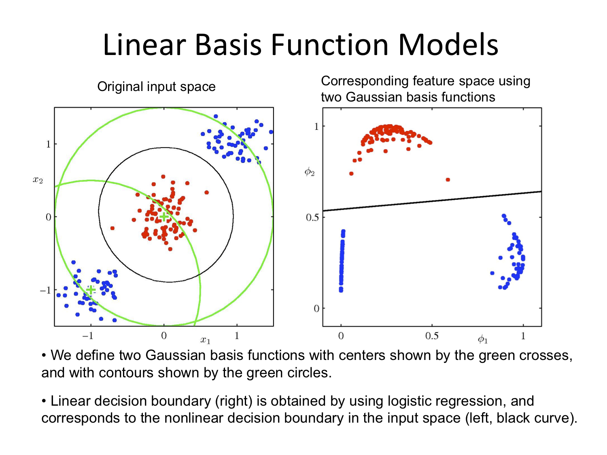

# Preamble

```{r options, include=FALSE}
htmltools::tagList(rmarkdown::html_dependency_font_awesome())
```

Most of the work in this file is the edited version of solutions provided by Prof. 
Daniel Simpson who is the instructor for this course.

](https://imgs.xkcd.com/comics/machine_learning.png)

## Resources

There is a number of resources available for you to learn and master the 
tidyverse package. It's technically not required for the course but it will
make your life a lot easier.

[Learn R with tidyverse](http://r4ds.had.co.nz/) - this on it's own should 
give you good enough background to handle most of the coding

[Advanced R with tidyverse](https://adv-r.hadley.nz/) - most likely far beyond
the scope of what's needed for the course

[Cheatsheets](https://www.rstudio.com/resources/cheatsheets/) - very useful set of cheatsheets 

There is a bunch more teaching materials avaialble on Alex's webiste:

[Additional Labs](https://awstringer1.github.io/leaf2018/)

If you are interested in catching up on some machine learning news, there is 
a great podcast available - [TWIMLAI](https://twimlai.com/). If you have 
some time to spare I highly recommend looking over some of the archival episodes,
[one of them](https://twimlai.com/twiml-talk-96-composing-graphical-models-neural-networks-david-duvenaud/)
features a Professor here at UofT Stats - David Duvenaud. It should be very
accessible even without a very strong machine learning background. They 
also have monthly online "meetups" with paper authors discussing stuff in more
detail.

## Library Load 

These are all the libraries we will be using in the course and some additional
ones for the extra work done from the R for Data Science textbook:

```{r library load, message=FALSE, warning=FALSE}
library(gridExtra)
library(MASS)
library(ISLR)
library(car)
library(modelr)
library(gapminder)
library(broom)
library(ggdendro)
library(dendextend)
library(e1071)
library(summarytools)
library(xgboost)
library(pROC)

# tidyverse goes last so that nothing overwrites the functions
library(tidyverse)
set.seed(217828)
```

# Week 1

Week 1 had no tutorials.

# Week 2

In the first tutorial we went over the great data notebook by Alex Stringer:

[Week 1 Tutorial](https://awstringer1.github.io/leaf2018/prediction-rossman-store-sales.html)

# Week 3 

## Question 2

```{r Question 2}

my_kmeans <- function(data, k, n_starts) {
	
done = FALSE # Initialize the condition vector
n = dim(data)[1] #data is a matrix, where each row is one data point

if (k == 1) {
	cluster = rep(1, n) #this vector says which cluster each point is in
	
	centers = apply(
		X = data,
		MARGIN = 2,
		FUN = mean
		) # Calculate the average distance
	
	cost = sum((data - centers[cluster]) ^ 2) # Compute the cost function for the single cluster
	
	return(list(cluster = cluster, cost = cost)) # Returns a list of [cluster, cost]
}

cluster_old = rep(1, n) # initialize clusters
cost_old = Inf # initialize cost

for (run in 1:n_starts) {
	cluster = rep(1, n) #this vector says which cluster each point is in
	#uniformly choose initial cluster centers
	centers = data[sample(
		x = 1:n,
		size = k,
		replace = FALSE)
	, ] # Sampling datapoints to be cluster centers
	
	while (!done) {
		# Do Step 2.1
		d = matrix(nrow = n, ncol = k) #initialize a matrix of size nxk
		for (j in 1:k) {
			d[, j] = apply(
			X = data,
			MARGIN = 1, #MARGIN = 1 => Rowwise
			FUN = function(d) sum((d - centers[j, ]) ^ 2)
		) # Computes the cost function for each point for each cluster center
			
		}
		cluster_new = apply(
			X = d,
			MARGIN = 1,
			FUN = which.min
			) # Take the minimum of the costs
		
# Throw an error if there is a cluster with no points in it
if (length(unique(cluster_new)) < k) stop("Empty cluster!") 

		
# Do Step 2.2
		for (i in 1:k) {
			centers[i, ] = apply(
				X = data[cluster_new == i, ],
				MARGIN = 2, #MARGIN = 2 => Columnwise
				FUN = mean) # Computes mean of the cluster for each cluster
		}
		
# Check if the cluster assignements changed. If they have, set done=TRUE
		if (all(cluster == cluster_new)) {
			done = TRUE
		}
		
		# Update step 
		cluster = cluster_new
	} #end of while not done
	
cost = sum((data - centers[cluster, ]) ^ 2) # Compute the cost

if (cost_old < cost) {
	cluster = cluster_old
	cost = cost_old
	}
	
	cost_old = cost
	cluster_old = cluster
} # if the cost increased, undo

return(list(cluster = cluster, cost = cost))
}

```

### Task : Use this algorithm to make a 4 clustering of the data set in question2.RData. Comment on the clustering.

```{r Q2 continued}

# Load the data from a data file 
load("~/Desktop/University/Statistics/TA-ing/STA314/T2/question2.RData")

# Load the data from a csv file
#data_q2 <- read_csv("Question2_data.csv")


out = my_kmeans(dat_q2 #data 
				, 4 # number of clusters
				, 2 # number of runs
				)

dat_q2$cluster = out$cluster # Assign to the column "cluster" in dat_q2 the column "cluster" in out

dat_q2 %>% ggplot(aes(x = x,y = y)) +
	geom_point(aes(colour = factor(cluster))) #plot

```

Depending on how many times the kmeans algorithm is run, it sometimes doesn’t find all four distinct clusters.
This is due to the uniform intial sampling and the fact that the bottom left and top right clusters are much
smaller than the other two. Try increasing the number of runs! 

## Question 3

```{r Question 3}

# Input the data
d = matrix(c(0, 0.3, 0.4, 0.7,
0.3, 0, 0.5, 0.8,
0.4, 0.5, 0.0, 0.45,
0.7, 0.8, 0.45, 0.0), nrow = 4)


# Set it as distance
d = as.dist(d)
```


```{r Q3 Complete Linkage}
# Plot the clusters with complete linkage:
plot(hclust(d,method = "complete"))
```

```{r Q3 Single Linkage}
# Plot the clusters with complete linkage:
plot(hclust(d,method = "single"))
```

```{r Q3 Average Linkage}
plot(hclust(d,method = "average"))
```

Comparing the two dendrograms, we see that the two clustering from the complete linkage is \{1,2\}, \{3,4\},
while the two clustering from the single linkage is \{1,2,3\}, \{4\}.

```{r Cleanup Week 2, include = FALSE}
rm(list = ls())
```

## Question 4 

For part a) there is not enough information. If the two linkages are equal, then they will fuse at the same
hight. Otherwise, the single linkage dendrogram will merge at a lower hight as it only requires one nearby
point and not all of the points to be close.

For part b) They’ll merge at the same hight because when you’re just merging single leaves, the linkages all
reduce to the distance and are therefore equal.

# Week 4

## Lab 2
Medium house value (medv) for 506 neighborhoods in Boston.
Includes 13 predictors such as: 
Avg number of rooms in the house, Avg age of houses, socioeconomic status.
```{r Question 2.1 - loading the data}
# Load the data: (from the MASS package)
data(Boston)

# Check names of variables:
names(Boston)
```

Let's try fitting a linear model of medv ~ lstat (socioeconomic status)
```{r Question 2.2 - building the lm object}
# Results in an error - doesn't know where to get the data from.
# lm_fit <- lm(medv ~ lstat)

# Need to specify data = , this is good practice as opposed to following the 
# order set by R inside of the functions most of the time.
lm_fit <- lm(data = Boston, formula = medv ~ lstat)
```

Now let's see what the result of the lm function looks like:
```{r Question 2.3 - exploring the lm object}
# Basic information:
lm_fit

# More comprehensive:
summary(lm_fit)

# What are the contents of lm?
names(lm_fit)

# Extracting p-values:

## Save the summary(lm) as an object! 
sum_lm <- summary(lm_fit)

## P-values are stored with coefficients in the fourth column:
### Intercept P-value:
sum_lm$coefficients[,4][1]
### lstat P-value:
sum_lm$coefficients[,4][2]

# Or you can just call it directly:
summary(lm_fit)$coefficients[,4][1]
```

Now how about predicting and plotting the data:

```{r Question 2.4 - predicting and plotting (base)}
# Find the intervals for new data

# Confidence intervals:
predict(lm_fit, data.frame(lstat = c(5, 10, 15)),
        interval = 'confidence')

# Prediction interals: 
predict(lm_fit, data.frame(lstat = c(5, 10, 15)),
        interval = 'prediction')

# Plotting:
plot(Boston$lstat, Boston$medv)
abline(lm_fit)

# Playing around with base graphics
plot(Boston$lstat, Boston$medv)
abline(lm_fit ,lwd = 3)
abline(lm_fit ,lwd = 3,col = "red")
plot(Boston$lstat ,Boston$medv ,col = "red")
plot(Boston$lstat ,Boston$medv ,pch = 20)
plot(Boston$lstat ,Boston$medv ,pch = "+")
# Some available symbols:
plot(1:20, 1:20, pch = 1:20)

# Plotting multiple plots on the same line
par(mfrow = c(2,2))

# plot diagnostics
plot(lm_fit)

# revert back to 1 plot per plot
par(mfrow = c(1,1))

plot(predict(lm_fit), residuals(lm_fit))
plot(predict(lm_fit), rstudent(lm_fit)) # standardized residuals

# We observe non-linearity - compute the leverage stats and see which one has the largest
plot(hatvalues(lm_fit))

# Which observation has the highest leverage:
which.max(hatvalues(lm_fit))
```

```{r Question 2.5 - plotting using ggplot}
# Or plotting using ggplot:
p <- ggplot(data = Boston, aes(x = lstat, y = medv))
p <- p + geom_point()
p <- p + geom_smooth(method = "lm", colour = "red")
p <- p + theme_bw()
p
```


```{r Question 2.6 - multiple regression}
# We can add age to our model (without the interaction)
lm_fit2 <- lm(medv ~ lstat + age, data = Boston)
summary(lm_fit2)

# We can use all the variables available:
lm_fit3 <- lm(medv ~ ., data = Boston)
summary(lm_fit3)

# We can use all the variables but one:
lm_fit4 <- lm(medv ~ . -age, data = Boston)
summary(lm_fit4)

# Can also update the previous model variables to exclude age:
update(lm_fit3, ~ . -age)
summary(lm_fit3)

```

One big problem with multiple regression is Multicolinearity, to 
investigate if this is an issue with our models we will be using the car 
package.

```{r Question 2.7 - VIF}
# print Variance Inflation Factors: Common cutoffs are 10 or 5
vif(lm_fit3)
```

The interpretation of VIF is that if say VIF(tax) = ~9, then the standard error
for the coefficient associated with tax is $ \sqrt{9} = 3 $ times as large
as it would be if the variables were uncorrelated.

```{r Question 2.8 - Interactions}
# If we want to include the interactions between variables we use the * symbol 
summary(lm(medv ~ lstat * age, data = Boston))
# it automatically includes the variables themselves in the call!

# We can also add non-linear transformations of predictors:
lm_fit_square <- lm(medv ~ lstat + I(lstat^2), data = Boston)
summary(lm_fit_square)
plot(lm_fit_square)

# Test if the model with a square is better than the simpler one:
anova(lm_fit, lm_fit_square)

# We can include higher polynomials:
summary(lm(medv ~ poly(lstat, 10), data = Boston))
# As we can see up to the 5th power all are statistically significant!

# We can also include different functions:
summary(lm(medv ~ log(lstat), data = Boston))
```


## R for data science chapter 25: Many Models
This is beyond the scope of what we teach, but you might find it very useful in practice:

```{r CH25: New Dataset}
# We will be using the modelr and gapminder libraries for this part
gapminder
```

```{r CH25: First Plot}
# plot life expectancy over time by country
gapminder %>% 
  ggplot(aes(x = year, y = lifeExp, group = country)) +
    geom_line(alpha = 1/3)
```

It's really hard to see what is going on!

Solution: 
Do it by country and nest all of the results in a table

```{r CH25: Nesting, message=FALSE}
# Create a tibble that separates each country's data into a separate tibble:
by_country <- gapminder %>% 
  group_by(country, continent) %>% 
  nest()
# We group by country and continent since for a country continent is fixed and we 
# want to carry on another variable

# View the data:
by_country
```

In this dataset each row is the complete dataset for a country, 
instead of being just one of the observations.

Now we want to fit a separate model for each of those rows:

```{r CH25: Nested models}
# First we define the function that creates a linear model:
country_model <- function(df) {
  lm(lifeExp ~ year, data = df)
}

# Then we can abuse the purrr package to apply that function to each of 
# the elements of a list:
by_country <- by_country %>%
	mutate(model = map(data, country_model))

# Now the column "model" in the by_country tibble contains all of the linear models we just fit!
by_country
```

Now we want to look at the residuals, acessing models stored within tibbles is a hassle,
so we can unnest the models:

```{r CH25: Unnesting}
by_country <- by_country %>% 
  mutate(
    resids = map2(data, model, add_residuals)
  )

# Let's unnest the residuals:
resids <- unnest(by_country, resids)

# Plot the residuals:
resids %>% 
  ggplot(aes(year, resid)) +
    geom_line(aes(group = country), alpha = 1 / 3) + 
    geom_smooth(se = FALSE)

# Let's see the residuals by continent:
resids %>% 
  ggplot(aes(year, resid, group = country)) +
    geom_line(alpha = 1 / 3) + 
    facet_wrap(~continent)
```

```{r Cleanup Week 3, include = FALSE}
rm(list = ls())
```

# Week 5

## Principal Component Analysis

**With thanks to Alex Stringer for teaching me this in STA414**

### Motivation:

Sometimes we are given a dataset containing a much larger number of features
than what we like for analysis. (We will see this specifically in lab 3).
*Principal Component Analysis* is one way of reducing the number of features
while maintaining as much information about the original data as possible.

### Procedure:

Given a $n$ datapoints with $p$ features each, PCA tries to find a low-dimensional
$d < p$ factorization of the data matrix $X$ that preserves the maximum possible variance.

$$ X = UZ $$
$$ X \in \mathbb{R}^{n \times p} $$
$$ Z \in \mathbb{R}^{d \times p} $$
$$ U \in \mathbb{R}^{n \times d} $$

We estimate $U$ from the data, and call the associated $Z$ the principal components of $X$.

PCA is thus states as follows:

<center>

for $j = 1, ..., d$ 

</center>

$$ \mathbf{u}_j = argmax(Var(\mathbf{u}^T\mathbf{x})) = argmax(\mathbf{u}^T\mathbf{Su}) $$

<center>

subject to: 

</center>

$$ \mathbf{u}^T\mathbf{u} = 1 ,~~ \text{and } ~ \mathbf{u} \perp \mathbf{u}_k ~~ \text{for} ~~ k < j $$

Where S is the sample covariance matrix:
$$ \mathbf{S} = \frac{1}{n}\sum_{i = 1}^{n}{(\mathbf{x_i} - \mathbf{\bar{x}})(\mathbf{x_i} - \mathbf{\bar{x}}) ^T} $$

Using lagrange multipliers we see the solution to the above problem
must satisfy:

$$ \mathbf{S}\mathbf{u}_1 = \lambda \mathbf{u}_1 $$
Which means that $\mathbf{u}_1$ is an eigenvector of S with the eigenvalue $\lambda$.

By definition of the problem $\lambda$ must be the largest eigenvalue.
This is since it doesn't the second constraint (as there is no previously selected vectors)

Solving this constrained optimization problem gives us an orthonormal basis
where the basis vectors point in the directions of the principal axes
of the sample covariance matrix, in decreasing order of length.

It's equivalent to the rotation in the original input space!

We then proceed to "chop off" the $d-p$ dimensions with least variance. And 
call this the basis for our $d$ dimensional space.

So, the solution to the PCA problem is:

1) Choose $\mathbf{u}_j$ to be normalized eigenvector of $\mathbf{S}$ corresponding 
to the $j$-th highest eigenvalue.

2) Choose $\mathbf{U}$ to be the matrix of orthonormal eigenvectors of S,
so that $\mathbf{U}^T\mathbf{U} = \mathbf{I}$

3) Then $\mathbf{Z} = \mathbf{XU}^T$.

4) Keep only the first d columns of $\mathbf{Z}$ and the corresponding
$d \times d$ submatrix of $\mathbf{U}$

5) Reconstruct the data as $\mathbf{X}^* = \mathbf{Z}^*\mathbf{U}^*$

## Lab 1: PCA

```{r dataset load}

# See variable names
colnames(USArrests)
# Display means of each row
USArrests %>% summarize_all(funs(mean))
# Display means and variances of each row
USArrests %>% summarize_all(.funs = c(Mean = mean, Variance = var))

```

There is a built-in function in R to do the principal component analysis:

It automatically scales the data to have the mean of 0

There is an added parameter *scale* which will also scale the standard 
deviation to 1.

In general there are at most $min(n-1,p)$ informative principal components.

```{r PCA in practice}
# compute the PCA
pca_out = prcomp(USArrests , scale = TRUE)
# output the rotation matrix
pca_out$rotation
# output the reconstructed data in the new coordinates:
pca_out$x

# To get the variance explained by each of the prinicpal components we take the 
# square of the std deviation:
pca_var <- pca_out$sdev^2
pca_var

# To get the proportion of variance explained we just need to divide by the sum:
pca_varprop <- pca_var / sum(pca_var)
pca_varprop
```


```{r plots}
# Plots using base R:
plot(pca_varprop , xlab = " Principal Component ",
	 ylab = "Proportion of Variance Explained ",
	 ylim = c(0,1), type = "b")

plot(cumsum(pca_varprop), xlab = "Principal Component ",
	 ylab = "Cumulative Proportion of Variance Explained",
	 ylim = c(0,1), type = "b")

# Plots using ggplot:
## Create the combined dataset:
df <- tibble(PCA = 1:4, VarianceProportion = pca_varprop)

ggplot(data = df, aes(x = PCA, y = VarianceProportion)) +
	geom_line() +
	geom_point() +
	labs(x = "Principal Component", y = "Proportion of Variance Explained") +
	geom_text(aes(label = round(VarianceProportion,2)), vjust = -1) +
	scale_y_continuous(limits = c(0, 1))

ggplot(data = df, aes(x = PCA, y = cumsum(VarianceProportion))) +
	geom_line() +
	geom_point() +
	labs(x = "Principal Component", y = "Cumulative Proportion of Variance Explained") +
	geom_text(aes(label = round(cumsum(VarianceProportion),2)), vjust = 2) +
	scale_y_continuous(limits = c(0, 1))
```

```{r PCA in practice part 2}

# standardize all the variables
USArrests_std <- USArrests %>% mutate_all(.funs = (scale))

varcov_matrix <- cor(USArrests_std)
varcov_matrix

# look at the eigenvectors and eigenvalues of the var cov matrix
e <- eigen(varcov_matrix)
e
# Compute the eigenvector transformation

for (i in 1:length(names(USArrests_std))) {
	assign(paste0("PC", i), 
	as.vector(USArrests_std$Murder * e$vectors[1,i] +
	USArrests_std$Assault * e$vectors[2,i] + 
	USArrests_std$UrbanPop * e$vectors[3,i] +
	USArrests_std$Rape * e$vectors[4,i]))
}

manual_PCA <- tibble(PC1 = PC1, PC2 = PC2, PC3 = PC3, PC4 = PC4)
auto_PCA <- as.tibble(pca_out$x)

difference = manual_PCA - auto_PCA
difference
```

## Lab 3: PCA and Clustering

```{r NCI60}

# Data Load
nci_labs <- NCI60$labs
nci_data <- NCI60$data

# Combine
nci <- as.tibble(nci_data)
nci$labels <- nci_labs

# It's a large dataset! 
dim(nci)

# Let's see what are the possible labels
unique(nci$labels)

# Let's see how many of each label:
nci %>% group_by(labels) %>% summarize(n())
# Not very many data points, with a lot of features!
```

Are all of those features really necessary? Let's try doing PCA and seeing 
what proportion of variance can be explained by taking just a few:

```{r NCI60 PCA}

# I don't want to rescale the labels (which are not numerical in the first place!)
nci_pca <- nci_data %>% prcomp(scale = TRUE)

# Since we will be plotting this data, we would like a function that assigns 
# a color based on the value of the label to each of the datapoints:

Colors = function(vec) {
	colors = rainbow(length(unique(vec)))
	return(colors[as.numeric(as.factor(vec))])
}

# Now let's plot the PCs 
par(mfrow = c(1,2))

# plot the first and second PC
plot(nci_pca$x[,1:2], col = Colors(nci_labs), pch = 19, xlab = "PC1",ylab = "PC2")
# plot the first and third PC
plot(nci_pca$x[,c(1,3)], col = Colors(nci_labs), pch = 19, xlab = "PC1", ylab = "PC3")

# Get back to regular plotting:
par(mfrow = c(1,1))
```

Now if we want to plot without having to write a function to assign colors
each time, we can use ggplot:

```{r Plotting PCA with ggplot}
# Save as tibble for convenience (you could probably get away with not doing this)
nci_pca_tb <- as.tibble(nci_pca$x)
# Add back the labels 
nci_pca_tb$labels <- nci$labels

# Plot (I'm dropping the argument names beyond this point)
ggplot(nci_pca_tb, aes(x = PC1, y = PC2, color = labels)) +
	geom_point()

# Doesn't this look 100 times simpler to do ?
ggplot(nci_pca_tb, aes(x = PC1, y = PC3, color = labels)) +
	geom_point()
```

For this reason, beyond this point, I will be rewriting all of visualizations 
from the labs into tidyverse code and omit the base R code.

```{r NCI60 PCA proportion of variance}

# Extract the variances
df <- tibble(PCA = 1:length(nci_pca$sdev), VarianceProportion = nci_pca$sdev^2 / sum(nci_pca$sdev^2))

# Plot just the variance explanation proportions
ggplot(data = df, aes(x = PCA, y = VarianceProportion)) +
	geom_line() +
	geom_point() +
	labs(x = "Principal Component", y = "Proportion of Variance Explained") +
	scale_y_continuous(limits = c(0, 1))

# Plot the cumulative variance explanation proportions 
ggplot(data = df, aes(x = PCA, y = cumsum(VarianceProportion))) +
	geom_line(color = if_else(cumsum(df$VarianceProportion) > 0.9, "red", "green")) +
	geom_point(color = if_else(cumsum(df$VarianceProportion) > 0.9, "red", "green")) +
	labs(x = "Principal Component", y = "Cumulative Proportion of Variance Explained") +
	scale_y_continuous(limits = c(0, 1)) +
	geom_line(y = 0.9)

```

The line on the second plot shows at which point you can cut out to keep
$90$% of variance ($90$% of information about data), which looks to be about
20 features.

Note that this is an improvent of an improvements since by just doing the PCA
we have decreased the number of features from 6830 to 64 which is a `r round((1 - 64/6830)*100,2)`%
decrease, without losing much information!

Now let's do some clustering to review what we were doing 2 weeks ago:

Again for simplicity of visualization I will be using the ggdendro package.

```{r NCI60 Hierarichical Clustering}

# Create a vector of types of Hierarchical clustering we covered
clustering_types <- c("complete", "average", "single")

# Perform HC in a loop and plotting
for (method in clustering_types) {
	# Good example of why %>% is a great operator and method chaining is important
	nci_data %>% # Take the data
	scale %>% # Rescale it
	dist %>%  # Create a distance matrix 
	hclust(method = method) %>% # Perform HC
	as.dendrogram %>% # Change type to dendrogram
	set("labels", nci_labs) %>% # Add the labels from the original data
	set("branches_k_color", k = 4) %>% # Split the tree into 4 classes and color
	set("labels_cex", 0.5) %>%
	plot(main = paste0(method," linkage"))
}
```

This illustrates just how different results can be for the types of HC we learned.
Complete and average linkages usually result in similarily sized clusters, while 
Single linkage usually results in a single large cluster that has single leaves
added to it at each step. Now let's compare Complete Linkage with K-Means clustering

```{r NCI60 K-Means vs Complete linkage}

# Create the complete linkage clustering
cl_clusters <- nci_data %>% # Take the data
	scale %>% # Rescale it
	dist %>%  # Create a distance matrix 
	hclust(method = "complete") %>% # Perform HC
	cutree(k = 4) # cut 4 clusters

# Create the kmeans clustering
kmeans_clusters <- nci_data %>% # Take the data
	scale %>%
	kmeans(centers = 4, nstart = 20) # Perform K-Means for 4 clusters 20 times
	
# Create a comparison Table:
table(kmeans_clusters$cluster, cl_clusters)
```

From this table we can see that cluster 4 in k-means is the same as cluster 3 in complete linkage,
but the other clusters are a mixture. For example cluster 3 in k-means is a combination of
11 elements from cluster 1 in CL and 9 elements of cluster 4 in CL.

```{r Cleanup, include=FALSE}
rm(list = ls())
```

## Question 3:

### Question:

By modifying the argument used in the lecture, argue that the second principal component of a (centred)
feature matrix $X$ should maximise the Rayleigh quotent of $X^TX$ over all vectors that are orthogonal to the
first principal component and show that this implies that the second prinicipal component is the eigenvector
of $X^TX$ that corresponds to the second largest eigenvalue.

### Solution:

*Solution adapted from [Alin Morariu](https://a-morariu.github.io/)*

\textbf{WTS:} The second principle component of a centred feature matrix $X$ should maximize Rayleigh's quotient up to being orthogonal to the fist principle component. 


\textit{Proof:} Note, this argument is almost trivial once we understand that we can order our set of eigenvalues and combining this with the following notation:

$$ v_2 = \text{arg} \max_{v \in \mathbb{R}^p, v \perp v_1 } \frac{v^T X^T X v}{v^T v} $$

All that this is asking, is that we find the eigenvector that maximizes
the quotient with respect to all vectors in $\mathbb{R}^p$ which are orthogonal
to $v_1$. Furthermore, this corresponds to taking the second largest
eignevalue from our ordered set. However, we will show this more rigorously
using the argument made in class.
We begin with the spectral decomposition of our feature matrix. 

$$X^T X = UDU^T \text{ and define } Z = U^Tv \text{ where } v \in \mathbb{R}^p $$

$$ \Rightarrow v^T X^T X v =
z^T D z =
\sum_{i=1}^{p} \lambda_i z_i z_i^T \leq \sum_{i=1}^{p} \lambda_2 z_i z_i^T =
\lambda_2 \sum_{i=1}^{p} z_i z_I^T =
\lambda_2 v^T U^T U v$$

The inequality above turns into an equality in the case where $z_3 = z_4 = \ldots = z_p = 0$;
otherwise we can say that $\lambda_2 \geq \lambda_i$ for
$i \in \{3, 4, \ldots, p\}$ which in turn maximizes
the quotient with respect to the constraints.
This concludes the proof.

## Question 4

### Question:

An experiment was undertaken to exmaine differences in burritos made across Toronto. 400 burritos were
purchased at commercial venues and four measurements were taken of each burrito: mass (in grams), length
(in centimetres), sturdiness (scored from 1-10), and taste (scored from 1-10). The scaled sample covariance
matrix was calculated and its four eigenvalues were found to be 14.1, 4.3, 1.2 and 0.4. The corresponding
first and second eigenvectors were:

$$v_1^T = [0.39, 0.42, 0.44, 0.69]$$ 
$$v_2^T = [0.40, 0.39, 0.42,−0.72]$$

i. What is the proportion of variance explained by the first two prinicple components?

ii. Give an interpretation of the first two principal components

iii. Suppose that the data were stored by recording the eigenvalues and eigenvectors together with the 400
values of the first and second principal components and the mean values for the original variables. How
would you use this information reconstruct approximations to the original covariance matrix and the
original data?


### Solution:

*Slightly modfied solution from [Alin Morariu](https://a-morariu.github.io/)*

Given: $\lambda^* = \{14.1, 4.3, 1.2, 0.4 \}$ ,
$v_1^T = [0.39, 0.42, 0.44, 0.69]$ , and
$v_2^T = [0.40, 0.39, 0.42, -0.72]$ 

#### i)

We are asked to calculate the proportion of variance explained by the fist 2 principle components.

$$\text{proportion explained} =
\frac{\sum_{i=1}^{2} \lambda_i }{\sum_{i=1}^{4} \lambda_i } =
\frac{14.1 + 4.3}{14.1 + 4.3 + 1.2 + 0.4} =
0.92 $$

#### ii)

Interpreting the principle components: 

First PC: Notice that each of the components have a positive coefficient
we can say that heavier and longer burritos have a tendency to be tastier.


Second PC: Here we see that the component corresponding to taste has a negative
coefficient which indicates that we have some burritos that are small, light, unsturdy
and tasty OR large, heavy, sturdy, and bland (their scores would be equivalent).

#### iii)

Here we are tasked with reconstructing the variance-covariance matrix of the
centred data based on our 2 eigenvectors, and 4 eigenvalues.
We back out the desired result from the spectral decomposition of the
variance-covariance matrix.

Since we only have the first two principal components we can only use the first 
two eigenvalues:

$$\hat{\Sigma} = \hat{U}\hat{D}\hat{U}^T = \sum_{i=1}^{2} \lambda_iv_i v_i^T = \lambda_1 v_1 v_1^T + \lambda_2 v_2 v_2^T  $$

Note that we have all of the quantities specified above so now its a matter of plugging in
the values and multiplying them together. 

$$\hat{\Sigma} = \left( \begin{array}{cccc} 
2.833 \\ 
2.980 & 3.141 \\
3.142 & 3.310 & 3.488 \\
2.556 & 2.879 & 2.980 & 8.942
\end{array} \right) $$

Noting that $\hat{\Sigma}$ is symmetric we can fill in the rest.

Remember that we framed the original data as:
$$ X = LU $$
Where $U$ are the principal components and $L$ is the loading matrix. 
Thus to retrieve the original data we need to multiply our eigenvectors by
our loading factors matrix to get estimates of mean corrected data.

$$ x_i^T =
\begin{pmatrix}
    l_1 & l_2
\end{pmatrix} 
\begin{pmatrix}
    v_1^T\\
    v_2^T
\end{pmatrix} = 
\begin{pmatrix}
    l_1 & l_2
\end{pmatrix} 
\begin{pmatrix}
    0.39 & 0.42 & 0.44 & 0.69\\
    0.40 & 0.39 & 0.42 & -0.72
\end{pmatrix}
$$

So:

$$ x_1^T =  \begin{pmatrix}
    0.39 \cdot l_1 + 0.4 \cdot l_2
\end{pmatrix}$$
$$ x_2^T =  \begin{pmatrix}
    0.42 \cdot l_1 + 0.39 \cdot l_2
\end{pmatrix}$$

etc. 

And then to retrive the original we need to add back the mean.

## Questions from the tutorial:

### Spectral Decomposition explanation

Any symmetric matrix A has a spectral decomposition of the form:

$$ A = Q \Lambda Q^{-1} $$

Where $Q$ is Orthogonal (its column vectors are orthogonal),
and $\Lambda$ is diagonal.

Let $v_i$ denote the $i$-th column of $Q$. 
Then $v_i^Tv_j$ is the $i,j$-th element of $Q^TQ = Q^{-1}Q = I$.
This means that each column of $Q$ has length $1$ and is perpendicular to every other column.

Multiplying the equation by $Q$ from the right yields:

$$ AQ = Q \Lambda Q^{-1} Q = Q \Lambda $$

If we interpret this by looking at columns of $Q$, $v_i$:

$$ Av_i = \lambda_i v_i $$

Where $\lambda_i$ is the $i$-th diagonal entry of $\Lambda$.

Which means that the $v_i$'s are eigenvectors of $A$ with eigenvalues $\lambda_i$!

### Why is variance-covariance positive semi-definite? i.e. why is $S = Q \Lambda Q^T$

A matrix $V$ is called positive semi-definite if for any vector $a$:

$$ a^T V a \geq 0  $$

[link to stack exchange for this answer](https://stats.stackexchange.com/a/53105)

And for the variance-covariance matrix $S$:

$$ S = \frac{1}{n}\sum_{i=1}^{n}{(x_i - \bar{x})(x_i - \bar{x})^T} $$

Then for every non-zero vector $a$ we have:

$$ a^TSa = a^T(\frac{1}{n}\sum_{i=1}^{n}{(x_i - \bar{x})(x_i - \bar{x})^T} )a$$
$$ = \frac{1}{n}(\sum_{i=1}^{n}{(a^T(x_i - \bar{x})(x_i - \bar{x})^Ta)} ) $$
$$ = \frac{1}{n}\sum_{i=1}^{n}{(((x_i - \bar{x})^Ta^T)((x_i - \bar{x})^Ta))} $$

$$ = \frac{1}{n}\sum_{i=1}^{n}{((x_i - \bar{x})^Ta)^2} \geq 0  $$

So the variance-covariance matrix $S$ is always positive semi-definite and symmetric. 

# Week 6

The solutions provided can be found [here](https://michalmalyska.github.io/STA314_T5_Sol.pdf)

# Week 7

## Lab 6

We will be using the Stock Market Data which is the part of the ISLR library.

This data set consists of percentage returns for the S&P 500 stock index over
1, 250 days, from the beginning of 2001 until the end of 2005.
For each date, we have recorded the percentage returns for each of the
five previous trading days, Lag1 through Lag5. We have also recorded
Volume (the number of shares traded on the previous day, in billions),
Today (the percentage return on the date in question) and
Direction (whether the market was Up or Down on this date).

```{r look at the data}

# Get rid of the Today variable since it's not relevant (we only care about)
# the sign of it which is encoded in the direction variable
df <- as.tibble(Smarket) %>% dplyr::select(-Today)
glimpse(df)
dfSummary(df)

# Extract the covariance matrix:
varcov <- df %>% dplyr::select(-Direction) %>% cov()
```

```{r Logistic Regression}

# Fit the model
glm.fit <- glm(formula = Direction ~ Lag1 + Lag2 + Lag3 + Lag4 + Lag5 + Volume ,
data = df ,family = "binomial" )
# Look at the summary
summary(glm.fit)

# Look at coefficients
coef(glm.fit)
summary(glm.fit)$coef #Equivalent

# Make predictions on the original data
glm.probs <- predict(glm.fit ,type = "response")

# What are the probabilities (0 = Baseline)
contrasts(df$Direction)

# Look at the first few probabilities
glm.probs[1:10]
```

Looks really bad! Probabilies are all very close to 50% so our model
is not very certain of either of the classes. We will take the 
threshold of 50% and see our accuracy based on that.

```{r Making Predictions}

# Initialize the vector of predictions
preds <- rep("Down", 1250)

# Replace to be the correct classes
preds[glm.probs > 0.5] <- "Up"

# See the table of counts of predictions (TP, FP , FN, TN)
table(preds, df$Direction)

# Calculate the accuracy
mean(preds == df$Direction )
```

We get an accuracy of 52% on the training set, this is only a bit better than 
a monkey throwing darts. But we have made a very significant error in practice:
We are looking at the error on the data the model was trained on, so in 
reality we don't know how well it will generalize. Let's fix this. 

In a classification problem we should make sure that both the training and the 
test set will have a similar proportion of classes as the actual problem.
In case of imbalanced problems (where one class is much more prevalent in data
than the other) we will be trying to up or down sample one of the classes 
so that the model is better at predictions, or we will be changing the loss function
penalties for misclassifying classes.

```{r split the data}

# Split the data
df %>% filter(Direction == "Down") -> down_data
df %>% filter(Direction == "Up") -> up_data

# Sample 70% of both datasets and combine
train_down <- sample_frac(down_data, size = 0.7)
train_up <- sample_frac(up_data, size = 0.7)
train = rbind(train_down, train_up)

# Take the test set to be the other 30%
test <- setdiff(df, train)
```

Now we can fit the model on the train and evaluate the performance on test

```{r train and test models}
glm.fit <- glm(data = train, formula = Direction ~.,family = "binomial")
summary(glm.fit)

test$probs <- predict(object = glm.fit, newdata = test, type = "response")

test$preds <- if_else(test$probs > 0.5, "Up", "Down")

mean(test$preds == test$Direction)
```

So the predictions are bad in general. Either the model is not apppropriate,
or data is not enough, or possibly both.

## Question 1

### Question

The loss function:

$$
L(h(x),y) = 
    \left\{ \begin{array}{rcl}
         0, && h(x)=y \\
         \alpha_{FP},  && h(x) = 1 \text{ and } y = 0 \\
         \alpha_{FN},  && h(x) = 0 \text{ and } y = 1 \\ 
    \end{array} \right.
$$

penalises false positives by $\alpha_{FP}$ and false negatives by $\alpha{FN}$.
Derive the optimal classifier under the assumption
that both the labels and the features are independently and identically distributed.
### Solution

For any classification function $h$, the expected loss can be given directly as:

$$ R(h) = \alpha_{FN}\mathbb{P}(h(x)=0,y=1|X=x) + \alpha_{FP}\mathbb{P}(h(x)=1, y = 0 | X=x) \\
= \alpha_{FN}\mathbb{P}(y=1|h(x)=0,X=x)\mathbb{P}(h(x)= 0|X=x) + \\
\alpha_{FP}\mathbb{P}(y=0|h(x)=1,X=x)\mathbb{P}(h(x)=1|X=x)
$$
Now, writing $m(x) = \mathbb{P}(y=1 | X=x)$ we can rewrite this as:

$$
R(h) = \alpha_{FN}m(x)(1-h(x)) + \alpha_{PN}(1-m(x))h(x)
$$

Now let $h^*$ be the optimal classifier. And let $h$ be any classifier.
We know that $R(h^*)-R(h) \leq 0$. And then:

$$R(h^*)- R(h) = -\alpha_{FN}m(x)h^*(x)+\alpha_{FP}h^*(x) - \alpha_{FP}m(x)h^*(x) \\
+ \alpha_{FN}m(x)h(x) - \alpha_{FN}h(x) + \alpha_{FP}m(x)h(x) = \\
= (h^*(x) - h(x))[\alpha_{FP}-(\alpha_{FN}+\alpha_{FP})m(x)]= \\
(\alpha_{FN}+\alpha_{FP})(h^*(x) - h(x))(\frac{\alpha_{FN}}{\alpha_{FN}+\alpha_{FP}} - m(x)) \leq 0
$$
We can see that his is exactly $0$ when:

$$
\mathbb{P}(y=1 | X=x) = m(x) = \frac{\alpha_{FN}}{\alpha_{FN}+\alpha_{FP}}
$$

## Question 2

### Question

This question generalizes logistic regression to the case where we have
K labels/groups. To do so, we set the Kth class as the baseline and
use a K-1 encoding system to solve the problem.
We are given the log-odds ratio for the i-th class.

### Solution

$$ \log \frac{\mathbb{P} (G = i | X = x) }{\mathbb{P} (G = K | X = x)} = \beta_{i,0} + \beta_i^Tx $$

We now exponentiate to get rid of the log. 

$$ \frac{\mathbb{P} (G = i | X = x) }{\mathbb{P} (G = K | X = x)} = \exp \{\beta_{i,0} + \beta_i^Tx \} $$

We can sum the above over all possible values of i.

$$\frac{ \sum_{i=1}^{K-1}\mathbb{P} (G = i | X = x) }{\mathbb{P} (G = K | X = x)} = \sum_{i=1}^{K-1} \exp \{\beta_{i,0} + \beta_i^Tx $$

The numerator of the left hand side can we simplified if we apply the law of total conditional probability with respect to G.

$$ \sum_{i=1}^{K-1}\mathbb{P} (G = i | X = x) = 1 - \mathbb{P} (G = K | X = x) $$

$$ \frac{1}{\mathbb{P} (G = K | X = x)} - 1 =  \sum_{i=1}^{K-1} \exp \{\beta_{i,0} + \beta_i^Tx \} \Rightarrow  \mathbb{P} (G = K | X = x) = \frac{1}{ 1 + \sum_{i=1}^{K-1} \exp \{\beta_{i,0} + \beta_i^Tx \}}$$

From the above, we can apply Bayes' Theorem to get the conditional probabilty of a single class.

$$ \mathbb{P} (G = j | X = x) = \frac{ \exp \{\beta_{j,0} + \beta_j^Tx \}}{ 1 + \sum_{i=1}^{K-1} \exp \{\beta_{i,0} + \beta_i^Tx \}}$$
This completes the proof.

# Week 8

Solutions to the practice midterm questions we did in class can be found
[here](https://michalmalyska.github.io/STA314_T7_Sol.pdf)


# Week 9

## Lab 5

To fit an SVC, it is enough to call the svm(.) function with an argument
kernel = "linear". It has the advantage over our formulation of directly
specifying the cost of violating the Marigin. Small cost -> wide marigins.

```{r Generate Data}
x <- matrix(rnorm(50*2), ncol = 2)
y <- c(rep(-1,25), rep(1,25))
x[y == 1,] <- x[y == 1,] + 1
plot(x, col = (3 - y))
```
Data is clearly not linearly separable. There are two options:

* Try to find a transformation of data that results in it being linearly
separable and then fit a linear model (See Linear Basis Function Models at the end)

* Fit a model that handles non-linearly separable data.

```{r Prepare data and fit SVC}
df <- data.frame(x = x, y = as.factor(y))
svcfit <- svm( y~., # Y as a function of all the other (so just x)
			   data = df, # Specify where the data comes from
			   kernel = "linear", # Fit an SVC (linear kernel)
			   cost = 10, # This is the cost of crossing the Margin
			   scale = FALSE) # Should the variables be scaled?
plot(svcfit , df)
plot(x[,2], x[,1], col = (3 - y))
```

The light blue side corresponds to the $-1$ class and the pink one is the 
$1$ class. 
The support vectors are plotted as crosses, and the rest as circles. In the plot
we can see `r length(svcfit$index)` support vectors. We can also identify
them by looking at the index of the svm object. We would also like to see
what is in the summary of said object.

```{r Looking at SVC index}
svcfit$index
summary(svcfit)
```

Let's now comare how changing the cost parameter changes the decision boundary.

```{r Changing SVC Cost}
svcfit2 <- svm( y~., # Y as a function of all the other (so just x)
			   data = df, # Specify where the data comes from
			   kernel = "linear", # Fit an SVC (linear kernel)
			   cost = 0.1, # This is the cost of crossing the Margin
			   scale = FALSE) # Should the variables be scaled?
plot(svcfit2 , df)
plot(x[,2], x[,1], col = (3 - y))
```
In this case the number of support vectors is expected to be higher,
and as we can see it's `r length(svcfit2$index)`. This is due to the 
fact that the penalty for crossing the margin is relaxed. 
Now let's look at what parameter results in the lowest possible loss via
cross-validation:

```{r SVC cost Cross Validation}
tune.out <- tune(svm ,y~.,data = df ,kernel = "linear",
				 ranges = list(cost = c(0.001, 0.01, 0.1, 1,5,10,100)))
summary(tune.out)
```

This function stores the best iteration of the model which can be accessed in the
following way:

```{r Best cross val SVC}
best <- tune.out$best.model
summary(best)
```

```{r Prediction from best model}
xtest <- matrix(rnorm(50*2) , ncol = 2)
ytest <- sample(c(-1,1), 50, rep = TRUE)
xtest[ytest == 1,] <- xtest[ytest == 1,] + 1
testdat <- data.frame(x = xtest, y = as.factor(ytest))

ypred <- predict(best ,testdat)
table(predict = ypred , truth = testdat$y )
```

Now let's see what would happen if the data was linearly separable. 

```{r Linearly Separable Data}
x[y == 1,] <- x[y == 1,] + 4
plot(x, col = (y + 5)/2, pch = 19)

df2 <- data.frame(x = x, y = as.factor(y))
svcfit_new <- svm(y~., data = df2, kernel = "linear", cost = 1e5)
summary(svcfit_new)
plot(svcfit_new, df2)
```

Let's try a smaller value of cost since this might not be very good at performing
on test data.

```{r Linearly Separable Data low cost}
svcfit_new2 <- svm(y~., data = df2, kernel = "linear", cost = 1)
summary(svcfit_new2)
plot(svcfit_new2, df2)
```

The decision boundary was linear as we expected, given that we 
specified it to be linear. Let's see what happens if we remove that constraint.

```{r Prepare data and fit SVM}
svmfit <- svm( y~., # Y as a function of all the other (so just x)
			   data = df, # Specify where the data comes from
			   cost = 10, # This is the cost of crossing the Margin
			   kernel = "polynomial",
			   scale = FALSE) # Should the variables be scaled?
plot(svmfit , df)
```

## Question 3

### Question:

Consider the support vector classifier with the Lagrangian 
$$
L(\beta,\beta_0,\xi,\lambda,\mu) = \frac{1}{2} \beta^T\beta + C\sum_{i=1}^n \xi_i - \sum_{i=1}^n\lambda_i\left[y_i(x_i^T\beta + \beta_0)-1 + \xi_i\right] - \sum_{i=1}^n \mu_i \xi_i
$$
Using the KKT equations, show that the optimal $\beta$ can be written as 

$$
\beta = \sum_{i=1}^n \lambda_iy_i x_i.
$$

Show that $\lambda$ solves 
\begin{align*}
&\max_\lambda \sum_{i=1}^n\lambda_i - \frac{1}{2}\sum_{i=1}^n \sum_{j=1}^n y_iy_j\lambda_i\lambda_j x_i^Tx_j\\
&\text{Subject to:}\\
&\qquad 0\leq \lambda_i \leq C,\quad i=1,\ldots, n \\
&\qquad \sum_{i=1}^n \lambda_i y_i = 0.
\end{align*}
Argue that 
\begin{align*}
\lambda_i = 0 & \Rightarrow y_i( \beta^T x_i + \beta_0) \geq 1 \\
\lambda_i = C & \Rightarrow y_i( \beta^T x_i + \beta_0) \leq 1 \\
0 < \lambda_i < C & \Rightarrow y_i( \beta^T x_i + \beta_0) = 1.
\end{align*}

### Solution:

The KKT conditions say that we need to satisfy $\frac{\partial L}{\partial \beta_0} = 0$. This implies $$
- \sum_{i=1}^n \lambda_i y_i \beta_0 = 0
$$ which is satisfied if $\sum_{i=1}^n \lambda_iy_i=0$.

We also need $\nabla_\beta L = 0$.  Doing the derivative, this condition is  $$
\beta -\sum_{i=1}^n\lambda_i y_i x_i = 0
$$ or, equivalently, $\beta =\sum_{i=1}^n\lambda_i y_i x_i$.

We also need $\nabla_\xi L =0$ which holds when $$
C1 - \lambda - \mu = 0,
$$ where $1$ is the vector of 1s. This implies $\mu_i = C - \lambda_i$. Combining this with the condition that $\mu_i \geq 0$ and $\lambda_i \geq 0$, it follows that $0 \leq \lambda_i \leq C$.

Substituting all of this into the Lagrangian we get 
\begin{align*}
L &= \frac{1}{2} \left(\sum_{i=1}^n\lambda_i y_i x_i\right)^T\left(\sum_{j=1}^n\lambda_j y_j x_j\right)
+ C\sum_{i=1}^n \xi_i - \sum_{i=1}^n\lambda_i\left[y_i(x_i^T\left(\sum_{j=1}^n\lambda_j y_j x_j\right) 
+ \beta_0)-1 + \xi_i\right] - \sum_{i=1}^n (C-\lambda_i) \xi_i \\
&=\frac{1}{2}\sum_{i=1}^n \sum_{j=1}^n\lambda_i\lambda_j y_iy_j x_i^Tx_j + C \sum_{i=1}^n \xi_i - 
\sum_{i=1}^n\sum_{j=1}^n \lambda_i\lambda_jy_iy_j x_i^Tx_j - \beta_0\sum_{i=1}^n \lambda_i y_i +  
\sum_{i=1}^n\lambda_i - \sum_{i=1}^n\lambda_i\xi_i - C\sum_{i=1}^n \xi_i + \sum_{i=1}^n \lambda_i\xi_i \\
&=\sum_{i=1}^n \lambda_i - \frac{1}{2}\sum_{i=1}^n \sum_{j=1}^n\lambda_i\lambda_j y_iy_j x_i^Tx_j .
\end{align*}

By strong duality, we want to find the $\lambda$ that maximizes this Lagrangian under the constraints, which gives 
\begin{align*}
&\max_\lambda \sum_{i=1}^n\lambda_i - \frac{1}{2}\sum_{i=1}^n \sum_{j=1}^n y_iy_j\lambda_i\lambda_j x_i^Tx_j\\
&\text{Subject to:}\\
&\qquad 0\leq \lambda_i \leq C,\quad i=1,\ldots, n \\
&\qquad \sum_{i=1}^n \lambda_i y_i = 0.
\end{align*}


Finally, by complementatry slackness we know that $\lambda_i[y_i(\beta_0 + \beta^Tx_i ) - 1 + \xi_i] = 0$ and $\xi_i(C-\lambda_i)=0$. When $\lambda_i=0$, that means that $C \xi_i=0$ which implies $\xi_i=0$, which means that the observation is on the correct side of the margin.  When $\lambda_i=C$, that means that $\xi_i\geq 0$ and hence, we are on teh wrong side of the margin.  If $0<\lambda < C$, the second complementary slackness condition gives $\xi=0$, while the first gives $[y_i(\beta_0 + \beta^Tx_i ) = 1$.

## Linear Basis Function Models

*Again with thanks to Alex Stringer*




# Week 10

## Question 2
```{r DT Exercise 5}
par(xpd = NA)
plot(NA, NA, type = "n", xlim = c(-2, 2), ylim = c(-3, 3), xlab = "X1", ylab = "X2")
# X2 < 1
lines(x = c(-2, 2), y = c(1, 1))
# X1 < 1 with X2 < 1
lines(x = c(1, 1), y = c(-3, 1))
text(x = (-2 + 1)/2, y = -1, labels = c(-1.8))
text(x = 1.5, y = -1, labels = c(0.63))
# X2 < 2 with X2 >= 1
lines(x = c(-2, 2), y = c(2, 2))
text(x = 0, y = 2.5, labels = c(2.49))
# X1 < 0 with X2<2 and X2>=1
lines(x = c(0, 0), y = c(1, 2))
text(x = -1, y = 1.5, labels = c(-1.06))
text(x = 1, y = 1.5, labels = c(0.21))
```

## Question 3

```{r DT Exercise 4}
p <- seq(0, 1, by = 0.01)
gini <- p * (1 - p) * 2
CE <- -(p * log(p) + (1 - p) * log(1 - p))
Class.Err <- 1 - pmax(p, 1 - p)
df <- tibble(p = p, gini = gini, CE = CE, ClassError = Class.Err)
ggplot(data = df, mapping = aes(x = p)) +
	geom_point(mapping = aes(x = p, y = gini), color = "red", shape = "G") +
	geom_point(mapping = aes(x = p, y = CE), color = "blue", shape = "C") +
	geom_point(mapping = aes(x = p, y = Class.Err), color = "green", shape = "E")
```

## Additional Material

This week we talked about Decision Tree algorithms, boosting, bagging, and 
model explainability. 

### Algorithms in Practice

If you are interested more in how we use those algorithms in practice, implementations,
parameters etc.

My code in Python using LightGBM package can be found
[here](https://www.kaggle.com/michalmalyska/testing-script-v3/code).
** note that the runtime of the kernel is just shy of 6 hours on the server **

What you mind find interesting in particular are the
[parameters](https://lightgbm.readthedocs.io/en/latest/Parameters.html)
for the Tree Models:

* n_estimators=10000; number of boosting iterations (so 10000 weak models)

* learning_rate=0.02; shrinkage rate (what should be the "strength" of each model)

* num_leaves=34; max number of leaves in one tree

* colsample_bytree=0.9497036; fraction of features to be considered for each tree
note that this is very far from $\sqrt{p}$ since p was around 1000, this could be ~3% not 95%

* subsample=0.8715623; fraction of data in each bag (I am not using the full dataset size at each step)

* max_depth=8; max deapth of each tree

* reg_alpha=0.041545473; L1 regularization parameter

* reg_lambda=0.0735294; L2 regularization parameter

* min_split_gain=0.0222415; minimum loss decrease for a split to be kept

* min_child_weight=39.3259775; minimum amount of data in each rectangle

If you are interested in how the parameter values were found I highly recommend
taking a deeper dive into 
[Bayesian Optimization](https://arxiv.org/pdf/1807.02811.pdf).

Let's now see how we can use the xgboost package in R to analyze some data.
I will be using the wine classification challenge from UCI.
[link](https://archive.ics.uci.edu/ml/datasets/wine)

```{r xgboost setup}
rm(list = ls())	
# Load the data
df <- read_csv("https://archive.ics.uci.edu/ml/machine-learning-databases/wine/wine.data",
		 col_names = c("Class",
		 			  "Alcohol",
		 			  "Malic Acid",
		 			  "Ash",
		 			  "Alcalinity of ash",
		 			  "Magnesium",
		 			  "Total phenols",
		 			  "Flavanoids",
		 			  "Nonflavanoid phenols",
		 			  "Proanthocyanins",
		 			  "Color intensity",
		 			  "Hue",
		 			  "OD280/OD315 of diluted wines",
		 			  "Proline"))
# Look at the class distribution
ggplot(data = df, aes(x = Class)) +
	geom_bar()
# We see that the classes are imbalanced but that's fine.
# I will try to create a new class feature to make it a binary classification
df2 <- df %>% mutate(Hue_class = if_else(Hue < 1, 0, 1)) %>% dplyr::select(-Hue)
df2 %>% group_by(Hue_class) %>% summarise(n = n())
# Now the classes are closer to balanced and we can drop the class variable.
```

Our task is now to predict wether Hue will be lower or higher than 1 for a given wine.
Hue_Class is our new response variable. Now I will walk you through setting up
the data to use xgboost. We need to convert our dataset into a Model Matrix.

```{r xgboost data load}
# Create a model matrix object, this is usually a way of dealing with data
# for xgboost.
MM <- model.matrix(df2, object = Hue_class ~. - 1)

# Create a training set
indexes = sample(1:nrow(df2), size = 0.7*nrow(df2),replace = FALSE)
MM_train <- MM[indexes,]
MM_test <- MM[-indexes,]

testset <- as.tibble(MM_test)

# Create the DMatrix type for xgboost.
dtrain <- xgb.DMatrix(data = MM_train, label = df2[indexes,]$Hue_class)

# Fit the model
xgb_model <- xgboost(data = dtrain,
        max.depth = 3,
        eta = 0.1,
        nrounds = 30,
        verbose = 1,
        objective = "binary:logistic"
        ) 

# Predict and test
predictions <- predict(xgb_model, MM_test)
predictions

# Plot the ROC for our tree
roc <- roc(response = df2[-indexes,]$Hue_class, predictions)
plot(roc)
print(roc$auc)

# This is not horrible!
# Let's see what our trees actually look like:
xgb.plot.tree(model = xgb_model, trees = 0)
xgb.plot.tree(model = xgb_model, trees = 1)
```